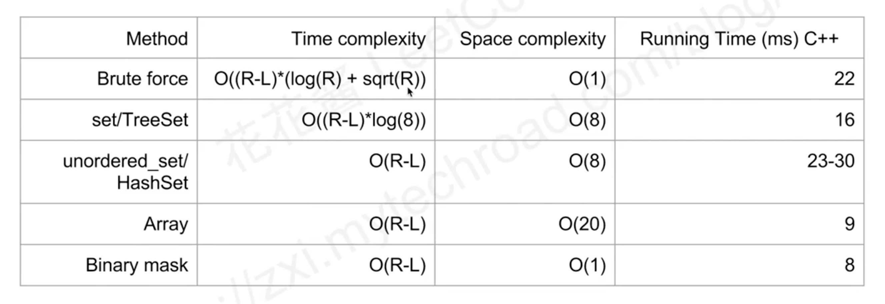

## [Prime Number of Set Bits in Binary Representation](https://leetcode.com/problems/prime-number-of-set-bits-in-binary-representation/description/)

`一遍过` `prime number` `bit opr`

1. 按照题意
>对 `[L,R]`之间的每个数计算set bit， 如果这个cnt是prime那么结果加1.
>prime计算的时候可以优化到`sqrt(x)`
>set bit 计算的时候也可以优化
>Time: O(R-L)
>Space: O(1)



```javascript
var countPrimeSetBits = function(L, R) {
    const isPrime = x => {
        //for (let i = 2; i < x; i++) {
        for (let i = 2; i <= Math.sqrt(x); i++) {
            if (x % i === 0) return false;
        }
        return x > 1;
    };
    const countSet = x => {
        let cnt = 0;
        // for (let i = 0; i < 32; i++) cnt += (x >>> i) & 1;
        for (; x > 0; x >>>= 1) cnt += x & 1;
        return cnt;
    }
    let arr = [];
    for (let x = L; x <= R; x++) arr.push(x);
    return arr.map(countSet).filter(isPrime).length;
};
```

---
