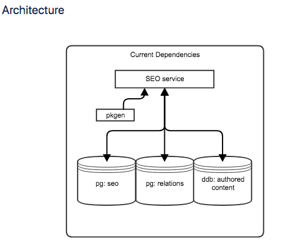

# seo service

精读 seo service
搞清楚底层架构

[SEO meta robots robots.txt](http://www.yesharris.com/meta-robots-and-robots-txt/)


## data types
* page level data
    * age redirects
    * titles
    * urls
* contents
    * authored contents

## data sources
* page level data
    * pg: seo
```
seo=# \d
                 List of relations
 Schema |         Name          | Type  |  Owner
--------+-----------------------+-------+----------
 public | calculated_price_data | table | postgres
 public | sep_seo_pages         | table | postgres
(2 rows)
```
```
seo=# \d sep_seo_pages
                   Table "public.sep_seo_pages"
         Column         |            Type             | Modifiers
------------------------+-----------------------------+-----------
 sep_seo_page_id        | bigint                      | not null
 sep_url                | text                        | not null
 sep_status             | integer                     | not null
 sep_redirect_url       | text                        |
 sep_title              | text                        | not null
 sep_description        | text                        |
 sep_is_noindexed       | boolean                     | not null
 sep_is_nofollow        | boolean                     | not null
 sep_last_modified_time | timestamp without time zone | not null
 sep_json_metadata      | jsonb                       | not null
 sep_header             | text                        |
Indexes:
    "sep_seo_pages_pkey" PRIMARY KEY, btree (sep_seo_page_id)
    "sep_url_index" UNIQUE, btree (sep_url)
    "sep_redirect_url_index" btree (sep_redirect_url)
```
* contents
    * ddb: authored contents
    * pg: relations

```
relations=# \d
                List of relations
 Schema |         Name         | Type  |  Owner
--------+----------------------+-------+----------
 public | idr_id_relationships | table | postgres
 public | relationship_types   | table | postgres
 public | tag_tags             | table | postgres
(3 rows)
```
```
relations=# \d idr_id_relationships
           Table "public.idr_id_relationships"
    Column     |            Type             | Modifiers
---------------+-----------------------------+-----------
 idr_parent_id | bigint                      | not null
 idr_type      | integer                     | not null
 idr_child_id  | bigint                      | not null
 idr_score     | double precision            | not null
 idr_created   | timestamp without time zone | not null
 idr_modified  | timestamp without time zone | not null
Indexes:
    "idr_id_relationships_pkey" PRIMARY KEY, btree (idr_parent_id, idr_type, idr_child_id)
    "idr_id_relationships_parent_id_type_score" btree (idr_parent_id, idr_type, idr_score DESC)
```

## why did we make a service for loading pages
* cachepacks
    * 内容过期
    * cache eviction -> load spike
* 不同type的page之间consistency不够好
    * Every page had its own way of handling things like page redirections, noindexing, nofollowing, title generation, http status codes, etc.

## seo services 解决上述的问题， 通过以下方式
* 用一张table来存储所有seo page相关的页面数据
* graph service :
    * e.g. fetch services and reviews , 本来两者是有dependency, services->reviews
    * 通过graph service 可以并发地取两者，不用顺序取.
* Page level meta data
* golang
    * 高并发
    * Asynchronous updates (data denormalization)


## reference
[wiki](https://thumbtack.atlassian.net/wiki/spaces/P/pages/607060145/SEO+Service+Brownbag+Notes)
