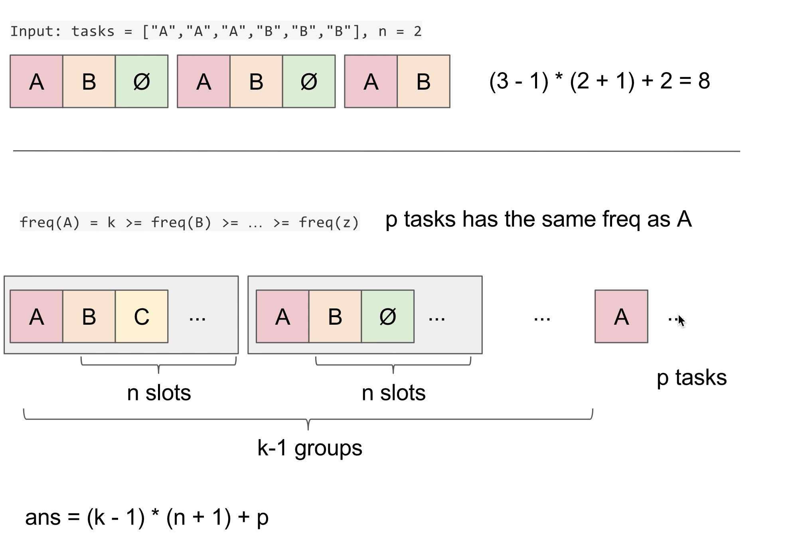
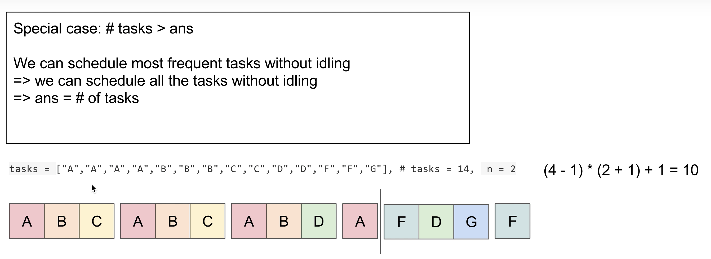

## [task scheduler](https://leetcode.com/problems/task-scheduler/description/)
`有思路` `代码脏` `greedy` `math` `simulation`




1. priority que simulation
> 贪心： 尽可能调度cnt比较大的task，这样可以有效填充cooling period。如果调度cnt较小的task，那么会导致cnt较大的task积累，不利于分散task种类。尽可能保留多种task好互相interleave。
> 实现的时候注意不要把heap和array 的length size 搞混

2. math
> 尽可能用不同的task填充cooling window， 最后一个cooling window填不满也没有关系，但是之前的cooling window需要用idle tick填充，这样的cooling window的个数是由出现次数最多的task 决定的 `maxCnt - 1`. (每一个window只负责完成其中一个task).
> 所以最多出现多少个相同的task，就需要多少个window，能够撑到最后一个window的task，一定是出现次数最多的那几个。
> 填充的时候按照出现次数顺序排序，就能保证同样的task之间间隔为cooling window
> 特殊情况是不需要idle

```javascript
var leastInterval = function(tasks, n) {
    //construct que for the tasks to be executed
    let taskQue = new Heap((a, b) => b - a);
    let cntMap = new Map();
    for (let task of tasks) cntMap.set(task, (cntMap.get(task) || 0) + 1);
    for (let task of cntMap.keys()) taskQue.push(cntMap.get(task));

    let ticks = 0;
    while (taskQue.size > 0) {
        let nextQue = [];
        for (let cooling = 0; cooling <= n; cooling++) {
            if (taskQue.size > 0) {
                let taskNum = taskQue.pop();
                taskNum--;//process the task
                if (taskNum > 0) nextQue.push(taskNum);
            }
            ticks++;
            if (taskQue.size === 0 && nextQue.length === 0) break;
        }
        // taskQue = nextQue; bug1 heap !== array
        while (nextQue.length > 0) taskQue.push(nextQue.pop());
    }

    return ticks;
};

leastInterval = function(tasks, n) {
    let cnts = new Array(26).fill(0);
    for (let task of tasks) {
        let idx = task.charCodeAt(0) - 'A'.charCodeAt(0);
        cnts[idx]++;
    }
    let maxCnt = Math.max(...cnts);
    let sameFreqNum = cnts.filter(cnt => cnt === maxCnt).length;
    let result = (maxCnt - 1) * (n + 1) + sameFreqNum;
    return Math.max(result, tasks.length);
};
```
