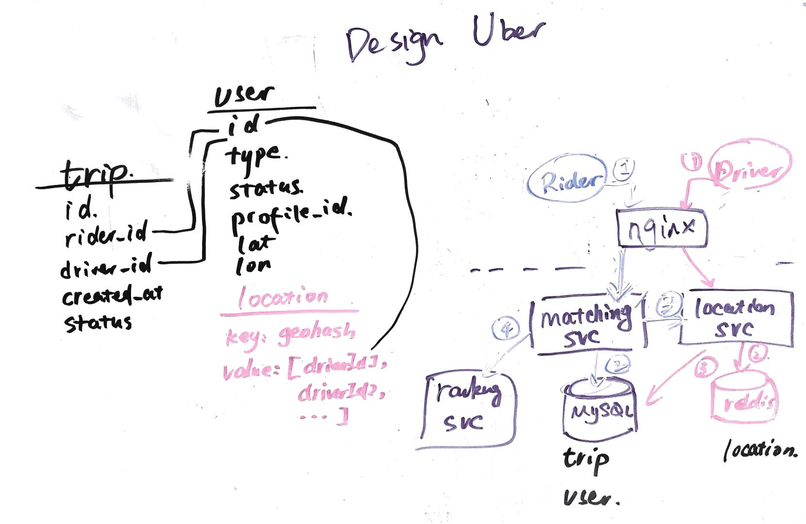

# design Uber

## geohash

### 2d SQL range query sucks
地图后台如何根据自己所在位置查询来查询附近餐馆的呢？苦思冥想了半天，机机想出了个方法：计算所在位置P与北京所有餐馆的距离，然后返回距离<=1000米的餐馆。

### narrow down the range
北京的餐馆何其多啊，这样计算不得了，于是想了，既然知道经纬度了，那它应该知道自己在西城区，那应该计算所在位置P与西城区所有餐馆的距离啊，机机运用了递归的思想，想到了西城区也很多餐馆啊，应该计算所在位置P与所在街道所有餐馆的距离，这样计算量又小了，效率也提升了

一提到索引，大家脑子里马上浮现出B树索引，因为大量的数据库（如MySQL、oracle、PostgreSQL等）都在使用B树。B树索引本质上是对索引字段进行排序，然后通过类似二分查找的方法进行快速查找，即它要求索引的字段是可排序的，一般而言，可排序的是一维字段，比如时间、年龄、薪水等等。但是对于空间上的一个点（二维，包括经度和纬度），如何排序呢？又如何索引呢？

如果能通过某种方法将二维的点数据转换成一维的数据，那样不就可以继续使用B树索引了嘛。

### 感性认知 geohash

* GeoHash将二维的经纬度转换成字符串，比如下图展示了北京9个区域的GeoHash字符串，分别是WX4ER，WX4G2、WX4G3(base 32, `0-9`, `a-z`, no `a,i,l,o`)等等，每一个字符串代表了某一矩形区域。也就是说，这个矩形区域内所有的点（经纬度坐标）都共享相同的GeoHash字符串，这样既可以保护隐私（只表示大概区域位置而不是具体的点），又比较容易做缓存
    * 比如左上角这个区域内的用户不断发送位置信息请求餐馆数据，由于这些用户的GeoHash字符串都是WX4ER，所以可以把WX4ER当作key，把该区域的餐馆信息当作value来进行缓存，而如果不使用GeoHash的话，由于区域内的用户传来的经纬度是各不相同的，很难做缓存。
* 字符串越长，表示的范围越精确。如图所示，5位的编码能表示10平方千米范围的矩形区域，而6位编码能表示更精细的区域
* 字符串相似的表示距离相近（特殊情况后文阐述），这样可以利用字符串的前缀匹配来查询附近的POI信息。
GeoHash就是一种将经纬度转换成字符串的方法，并且使得在大部分情况下，字符串前缀匹配越多的距离越近，回到我们的案例，根据所在位置查询来查询附近餐馆时，只需要将所在位置经纬度转换成GeoHash字符串，并与各个餐馆的GeoHash字符串进行前缀匹配，匹配越多的距离越近

### how to leverage geohash in databases
* SQL
    * 首先需要对 geohash 建索引
        * CREATE INDEX on geohash;
    * 使用 Like Query
        * SELECT * FROM location WHERE geohash LIKE `9q9hv%`

* Cassandra
    * 将 geohash 设为 column key
    * given current location `9q9hv`, 使用 range query (9q9hv0, 9q9hvz)

* key-value store (redis, memcached)
    * Driver 的位置分级存储
    * 如 Driver 的位置如果是 9q9hvt，则存储在 9q9hvt， 9q9hv， 9q9h 这 3 个 key 中
        * 6位 geohash 的精度已经在一公里以内，对于 Uber 这类应用足够了
        * 4位 geohash 的精度在20公里以上了，再大就没意义了，你不会打20公里以外的车
    * key = 9q9hvt, value = set of drivers in this location

----

## Step 1: Outline use cases and constraints

### Use cases (ask interviewer)
* **Rider** post a trip matching request, and found a matching driver
    * **Driver** can accept or decline the match
* **Driver** update his current location to the **Service**

### Constraints
* 假设问到 20 万司机 同时在线
* uber driver needs to update their location every 4s

### Load parameters
* QPS
    * write QPS = 200k / 4 = 50k write QPS
    * peak write QPS = 3 * 50k = 150k
    * compared to write QPS, read QPS can be ignored because rider won't have to update their locaitons so frequently
* Storage
    * 假如每条Location都记录：200 k * 86400 / 4 * 100bytes (每条位置记录）~ 0.5 T / 天
    * 假如只记录当前位置信息：200 k * 100 bytes = 20 M

* [handy conversion](back-of-env/#handy-conversion-guide)

---
## Step 2: Design core components

#### Services
* **Rider** post a trip matching request, and found a matching driver
    1. rider post a trip matching request
    2. `matching svc` creates a new trip record , mark trip status as `waiting`.
        * return the tripId to the client so it can use that to poll the server about the maching status
    3. `matching svc` asks `location svc` for the driver location data,
        * (lat,lng) → geohash → [driver_ID1, driver_ID2, …]
        * 先查6位的 geohash༌找0.6公里以内的
        * 如果没有༌再查5位的 geohash༌找2.4公里以内的
        * 如果没有༌再查4位的 geohash༌找20公里以内的
    4. `matching svc` asks `ranking svc` to get the best driver available for the current trip
        * `matching svc` sends trip info to the driver, drive can either accept or reject
        * if reject, go back to step 4, excluding the current driver
        * otherwise proceed to step5
    5. `matching svc` set the Driver status to be unavailable and set the trip status as `on-going`.
    6. `matching svc` return the trip info to both rider & driver.

* **Driver** update his current location to the **Service**
    1. driver post a location update (lat, lon)
    2. `location svc` receive the update and store the the redis location datastore
        * 计算当前位置 lat, lng的geohash (geohash4, geohash5, geohash6 ...)
        * 查询自己原来所在的位置, 对比是否发生变化, 并将变化的部分在 Redis 中进行修改
        * 在Driver Table中更新自己的最后活跃时间
    3. `location svc` updates the driver table (lat, lon) in the mySQL db

*

#### DB & schema

---

## Step 4: Scale the design

#### QPS high, server down
需求是150k QPS, Redis 的读写效率 > 100 QPS 是不是1-2台就可以了？What about redis server down?

DB starding to avoid single point of failure and distribute the load across cluster.

#### how to shard (sharding key)
* we can use geohash as sharding key, but there would be too many / few partitions if the geohash bit isn't choosen correctly.
* we can use the user's city as the sharding key
* for city 0 -> 100, check if the current location is inside the city .
* sharding key : city_id
* redis key: <city_id:geohash>

#### 乘客站在两个城市的边界上怎么办？
* 找到乘客周围的2-3个城市
* 这些城市不能隔太远以至于车太远
* 汇总多个城市的查询结果
* 这种情况下司机的记录在存哪个城市关系不大

#### How to check rider is in Airport?
分为两级Fence查询，先找到城市，再在城市中查询Airport Fence

#### How to reduce impact on db crash?
- master-slave replication (as partition has already alleviate the write pressue)
- leader-less replication (need to worry more about the consistency)
