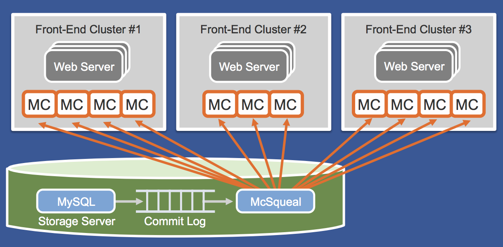
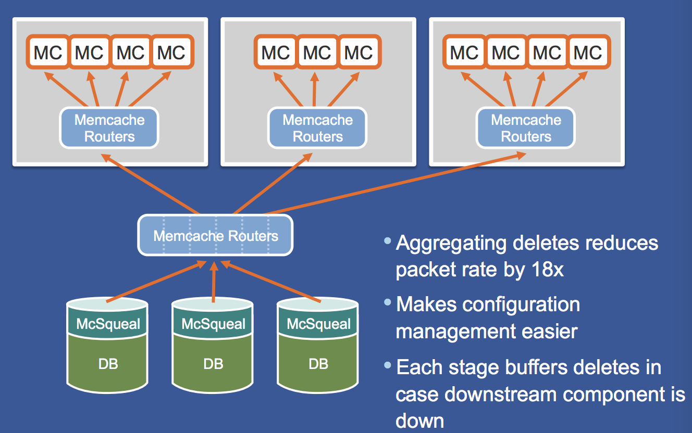

# Scaling memcache at Facebook

## Step 1: Outline use cases and constraints

### Use cases (ask interviewer)
* **User** makes a read or write request
    * **Service** does processing, stores user data, then returns the results
    * Aggregate content on-the-fly from multiple sources
    * be able to access & update very popular shared content
* **Service** needs to evolve from serving a small amount of users to millions of users
    * Discuss general scaling patterns as we evolve an architecture to handle a large number of users and requests
    * insulate the backend services from high read rates
    * system must be flexible enough to support rapid deployment of new features
    * geographically distribuetd
    * system needs to be consistent
* **Service** has high availability

### Constraints

* Traffic is not evenly distributed
* Near real-time communication
* Need for relational data
* Scale from 1 user to tens of millions of users
    * Denote increase of users as:
        * Users+
        * Users++
        * Users+++
        * ...
    * 10 million users
    * over 10 million writes per sec
    * over 1 billion reads / sec
    * 100:1 read to write ratio
    * 1 KB content per write

### Load parameters

* 1 TB of new content per month
    * 1 KB per write * 1 billion writes per month
    * 36 TB of new content in 3 years
    * Assume most writes are from new content instead of updates to existing ones
* over 10 million writes per sec
* over 1 billion reads / sec
* [handy conversion](back-of-env/#handy-conversion-guide)

---

## Step 2: Create a high level design
> Outline a high level design with all important components.

---
## Step 3: Design core components

If the # of users and the amount of data being fetched is not huge, then

* Use [**Horizontal Scaling**](https://github.com/donnemartin/system-design-primer#horizontal-scaling) to handle increasing loads and to address single points of failure
    * Add a [**Load Balancer**](https://github.com/donnemartin/system-design-primer#load-balancer) such as Amazon's ELB or HAProxy
        * highly available
        * If you are configuring your own **Load Balancer**, setting up multiple servers in [active-active](https://github.com/donnemartin/system-design-primer#active-active) or [active-passive](https://github.com/donnemartin/system-design-primer#active-passive) in multiple availability zones will improve availability
        * Terminate SSL on the **Load Balancer** to reduce computational load on backend servers and to simplify certificate administration
    * Use multiple **Web Servers** spread out over multiple availability zones
    * Use multiple **MySQL** instances in [**Master-Slave Failover**](https://github.com/donnemartin/system-design-primer#master-slave-replication) mode across multiple availability zones to improve redundancy
* Separate out the **Web Servers** from the [**Application Servers**](https://github.com/donnemartin/system-design-primer#application-layer)
    * Scale and configure both layers independently
    * **Web Servers** can run as a [**Reverse Proxy**](https://github.com/donnemartin/system-design-primer#reverse-proxy-web-server)
    * For example, you can add **Application Servers** handling **Read APIs** while others handle **Write APIs**

---
## Step 4: Scale the design
> Identify and address bottlenecks, given the constraints.

### A few memcache servers

#### Motivation
Our **Benchmarks/Load Tests** and **Profiling** show that we are read-heavy (100:1 with writes) and our database is suffering from poor performance from the high read requests.

#### How to scale
* deploy a few memcache hosts to handle the read capacity
* Move the following data to a memcache to reduce load and latency:
    * Frequently accessed content from **MySQL**
        * First, try to configure the **MySQL Database** cache to see if that is sufficient to relieve the bottleneck before implementing a **Memory Cache**
    * Session data from the **Web Servers**
        * The **Web Servers** become stateless, allowing for **Autoscaling**
    * Reading 1 MB sequentially from memory takes about 250 microseconds, while reading from SSD takes 4x and from disk takes 80x longer.<a href=https://github.com/donnemartin/system-design-primer#latency-numbers-every-programmer-should-know>1</a>
* Add [**MySQL Read Replicas**](https://github.com/donnemartin/system-design-primer#master-slave-replication) to reduce load on the write master
    * Add logic to **Web Server** to separate out writes and reads
    * Add **Load Balancers** in front of **MySQL Read Replicas** (not pictured to reduce clutter)
* Add more **Web Servers** and **Application Servers** to improve responsiveness

#### details about memcache
* cache-aside to store only the demanded data. Common case is data is available in the cache
* memcache needs to be invalidated after db write
    * prefer deletes to sets/updates
      * deletes are indempotent , no race condition
      * match the demand filled purpose

#### Problems with look aside caching
* stale sets
    * client A get(x) -> cache miss -> get x = A from db -> gc pause
    * client C update(x, B) -> db UPDATE X = B -> invalidate mem cache
    * client B get(x) -> cache miss -> get x = B from db -> update mem cache x = B
    * client A resumes from gc pause -> update mem cache x = A
    * now memcache has x = A, while db has x = B
* extend memcache protocol with `lease` (读cache miss给lease, 写不给，只负责让lease过期)
    * upon cache miss, return a lease-id 读的时候cache miss，再更新memcache之前有可能db的内容已经被人修改了，所以lease-id代表更新的有效性。
    * 如果db被其他的写操作修改，那么memcache被invalidate之后，会让之前的lease-id失效，以防止update覆盖原来的stale data. 失效的lease-id将无法进行回写 memcache的操作.
* thundering herds
    * 一个 celebrity 发布的状态被八方评论点赞，导致所有的流量都集中在某一个数据上，这个时候很多写操作导致cache invalidate -> 更多的cache miss -> data flows to MySQL -> sharding doens't help as it's for the same record -> can't handle the load
    * 罪魁祸首是 huge amount of client asking for the same data at nearly the same time
    * extend lease to allow memcache server to arbitrate access to database, 第一个cache miss的那个家伙你来做代表把，其他人等一等哈，Requests for a key’s value within 10 seconds of a token being issued results in a special notification telling the client to wait a short amount of time. 之后再做query， cache应该就hit了.
* slightly stale value
    * 让那些thundering herds 一直等也不是必要的，有的时候他们可以get away with stale data，那还等个屁，直接拿走stale data就好。
    * since the cached value tends to be a monotonically increasing snapshot of the database, most applications can use a stale value without any changes.
    * 那些herds 拿到lease id的同时也会拿到stale data. 这就要求invalidate的时候要存储一下stale data.

### Many memcache services in one front-end clusters

#### Motivation

- Even more read capacity is required
- Items are distributed across memcache servers by using
consistent hashing on the key
- Individual items are rarely accessed very frequently so over replication
doesnʼt make sense
- All web servers talk to all memcache servers
- Accessing 100+ memcache servers to process a user request is
common

#### How to scale

* Incast congestion
  * Many simultaneous responses overwhelm shared networking resources
  * 一个client如果贪快访问 100+ memcache server, 如果这些response 同时到达client的话，client networking 吃不消 packet drops
  * Limit the number of outstanding requests with a sliding window . 调整肛门大小，大肛门就会导致congestion & packet drops，小肛门导致more round trips

### Multiple front-end clusters

#### Motivation

- All-to-All limits horizontal scalability, 如果不停地一直增加memcache server和app server的数量的话，在一个cluster 内部network condition肯定越变越差，所以不如限制一下每个cluster的size，然后增加cluster的数量
- n * n * k < (n * k) * (n * k) = n * n * k * k
- 不过这就要求front end cluster的memcache和后台的 storage cluster保持data consistency

#### How to scale

* cache data must be invalidated after databse updates
* tail the mysql commit log and issue deletes based on transactions that have been commited
* allow caches to be resynchronized in the event of a problem

* 每个cluster派代表执行delete/invalidate 操作因为intra cluster操作比较快
* make configuration management easier
* each stage(memcache routers) buffers deletes in case downstream component is down

### Multiple regions

#### Motivation

* 不希望某个地区发生地震

#### How to scale
* single master db in one data centers
* multiple read replcas across different data centers
* writes in non-master
  * x = A in db (both master & slaves)
  * client A sets(x, B) -> write to master in another dc -> MySQL replication to clientB's local replica is ongoing ...
  * client B read(x) -> cache miss -> GET X=A from local db replica -> client B set memcache x = A
  * master finish MySQL replication and now all db replicas has X = B
  * db X = B but memcache in client B's cluster x = A
  * race condition happens at the db replica in Client B's data center
  * `remote markers` is a special flag that indicates whether a race is likely. 所以如果跨区写master操作会导致race，那么写之前先在本地cluster的memcache set `remote markers` 等replication结束之后再去除，这样就可以放心的在没有remote marker的时候读取本地db的数据了. 如果cache miss发现有remote marker，那么从master读数据.

## reference
- https://www.youtube.com/watch?v=6phA3IAcEJ8
