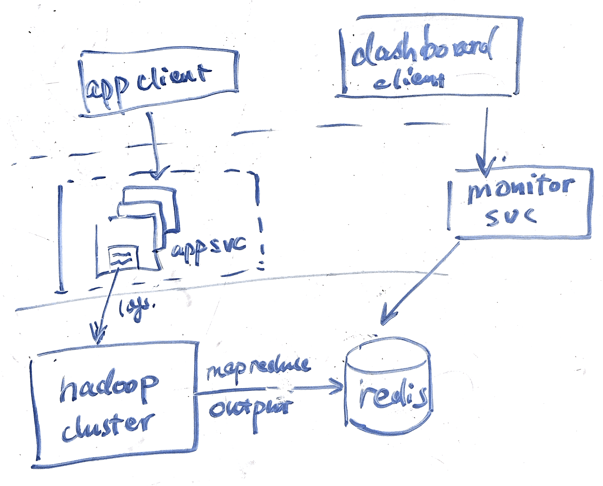

# top N java exception

## Step 1: Outline use cases and constraints

### Use cases (ask interviewer)
    * service有几百个machine再跑，一段时间内top10 java exception是什么？
    * 把这些monitor service partition
    * idea solution： map reduce，用exception 的signiture来hash做reducer的key.
    * clariy & desc issue

* **User** query the monitoring service for the top 10 java exception
* **Service** aggregate the java exception metrics from time to time.
* **Service** has high availability
* **Service** has low latency and doesn't impact existing service performance.

### Constraints

### Load parameters

* [handy conversion](back-of-env/#handy-conversion-guide)

---
## Step 2: Naive approach

### Naive way
The most naive approach is to have a daemon process on each app server and constantly shipping the logs to the monitoring service.

The monitoring service will perform:

1. filtering. find out the java exceptions related log entires)
2. in mem aggregation. count the number of each exception during the certain period of time
3. rank the top 10 based on the count

But this system has lots of bottlenecks:

1. the amount of data processing that needs to be done is tough for a centralized server with commodity hardware.
2. the server could crash at anytime, and the computation has to be started from the scratch again.
3. the size of the log data is too big to fit into the memory (lots of java exception times)

The list goes on and on.

### What if the # of log entries can't fit into memory

Since the job’s working set is larger than the available memory, the sorting approach has the advantage that it can make efficient use of disks. We can sort the log from each app server according to the java exception type, bring the same kind of exception together and use k way merge to merge the exceptions log entries from all the app server.
External merge-sort has sequential access patterns that perform well on disks.

But even if we do that, we still have the problem of this single server bottleneck, we lack the power of computation and the system is not fault tolerant.

### Map reduce

But the optimization is a bit like MapReduce, except that :

1. MapReduce will partition and sort the java expcetion log entries on the mapper nodes before the aggregation. which makes the data processing much faster by parallelism. You don't have to write code to explicitly handle the parallelism, the framework can handle the complexities of moving data between the machines.
2. MapReduce will redo the computation if there's any fault halfway (node crash, network interruptions...), our monitoring system doesn't have to worry about the output data being corruputed thanks to this abstraction.
3. If we use distribuetd file system such as HDFS, our system become much more reliable because the input & output log files will be replicated to multiple nodes to tolerate machine or disk failures.
4. The MapReduce scheduler (not shown in the diagram) tries to run each mapper on one of the machines that stores a replica of the input file. This principle is known as putting the computation near the data: it saves copying the input file over the network, reducing network load and increasing locality.

---

## Step 3: Design core components

> Dive into details for each core component.



### Use case: monitoring service creates an aggregate view of the exceptions.


1. The monitoring service reads a set of input files, and break it up into records. In the log, each record is one line in that log. We only consider the lines related to java exceptions so other lines will be filtered out.

2. Mappers extract a key & value from each log line. The key is the `hash of the java exception name`, the value is 1 (meaning appear once). The framework uses hash of the key to determine which reducer should receive the particular key-value pair. This ensures that the same key end up at the same reducer.
    * in mapper function , we will normailize the timestamp to hr, min, sec
    * for input line `(23:12:10, OOM)`, the output will be key: `(23:12:10, OOM), 1`. this is for aggregation within the last minute.
    * we can run multiple map tasks for different window size, the output `(23:12, JVM), 1` is for aggregation within the last hour

3. Mappper sort all of the key-value pairs by key. Each of these partitions is written to a sorted file on the mapper’s local disk.

4. Reduces start fetching the output files from the mappers and download the files of sorted key-values pairs for their partition. iterate over the sorted key-value pairs. It's easy to combine those values (aggregate the count) because the sorting has made them adjacent in the sorted list.

Let's assume this is a sample log entry :

```
timestamp   exception_name    
t1          OOM    
t2          JVM    
t3          RUNTIME    
t4          ...    
...
```

We'll use a multi-step MapReduce

* step1 transform the data to `(timestamp, exception_id), cnt`

```
(hr:min, exception1), 2
(hr:min, exception2), 1
(hr, exception1), 10
...
```

* step2 perform a distributed sort
```
(hr, 10), exception1
(hr, 7), exception2
(hr:min, 2), exception1
...
```

We can insert the result into a `exception_rank` table,
or an key value store such as redis or memcached for faster queries.
---

## Step 4: Scale the design


> Identify and address bottlenecks, given the constraints.
#### Motivation

#### How to scale
