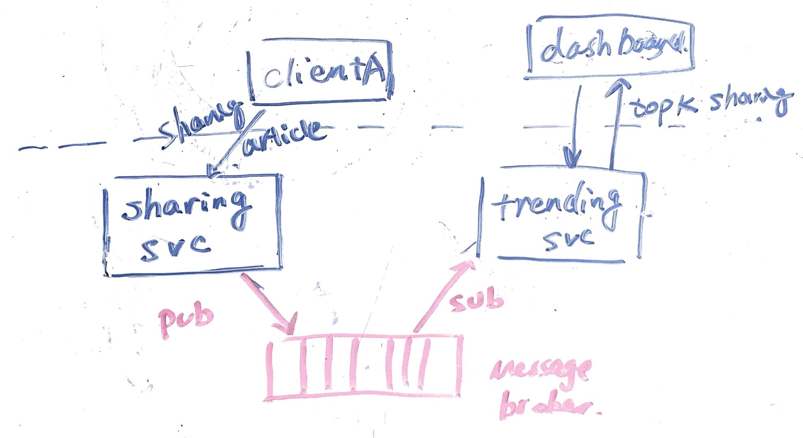

# trending shares  

```
    * top N exception, Linkedin users不停点share， most commonly shared articles in realtime, (not offline mapreduce)
    * component:
        1. existing service tier that handles share events
        2. aggregation services
        3. datastore
        4. some transformation to send notifications share event to aggregation service  
    * [design a trending topic](http://www.michael-noll.com/blog/2013/01/18/implementing-real-time-trending-topics-in-storm/)
```

## Step 1: Outline use cases and constraints

### Use cases (ask interviewer)

* **User** share an article on Linkedin
* **Service** needs to aggregate the shares during a given period of time and send notifications
* **Service** has high availability

### Constraints

* the metrics should be publish in realtime

### Load parameters

* [handy conversion](back-of-env/#handy-conversion-guide)

---
## Step 2: Create a high level design

> Outline a high level design with all important components.

### naive approach


A navie implementation will gather the sharing info in the database such as redis.

* Since it's write intensive, use a in memory cache such as redis would be a good choice.
* we can use a `trending svc` to constantly pull the redis and aggregate the sharing article and its frequency.
* after the aggregation , we can send notificaiton and store the result in a datastore for future queries.

However, this approach doesn't satisfy the constraints

* having a service to constantly poll the database for changes causes unecessary network trips and waste resources on both client and server.
* sharing svc is tightly couple to trending svc as they both have to agree on the format to store in the redis db.

So we can use message broker (like Kafaka) and connect the sharing service and trending service.

1. when a user share an article, the sharing service publish a message to the article-sharing topic
2. the message broker will deliver the message to the subscriber, trending svc
3. trending svc will do the aggregation , write the top K sharing articles to the datastore, and send notification if needed.



### how to aggregate

In this case, your state typically consists of a number of counters which are incremented when a message is processed. The aggregation is typically limited to a time window (e.g. 1 minute, 1 hour, 1 day) so that you can observe changes of activity over time.

The simplest implementation keeps this state in memory (e.g. a hash map in the task instances), and writes it to a database or output stream at the end of every time window. However, you need to consider what happens when a container fails and your in-memory state is lost. You might be able to restore it by processing all the messages in the current window again, but that might take a long time if the window covers a long period of time.

We can also store the state in an external datastore (on remote servers), but that additional network trip slow down the processing, which is against the real-time constraint. if we can partition the aggregation to different consumers and let them work on the aggregation independently , we could store the state in their local key value store for better persistence.

### db schema

We can maintain a sliding window if we can keep track of how many times the article has been shared in the past.

```
key, value
-----------
(article_id:timestamp), cnt
```

the timestamp is normalized to day, hr, min scale according to the need.

Each time a new message is delivered, we need to update the cnt for the smallest scale. And there is a background process in the `trending svc` to aggregate the finer scale timestamp.

The first step in the aggregation process is to aggregate event data into the finest required granularity. Then use this aggregation to generate the next least specific level granularity and this repeat process until you have generated all required views.


---

## Step 4: Scale the design

### batch report 每隔5~10秒向中心节点汇报数据
也就是说，哪些帖子被分享了多少次这些数据，首先在 sharing svc 的 web server 中进行一次缓存，也就是说web server的一个进程接收到一个分享的请求之后，比如 tweet_id=100 的tweet被分享了。那么他把这个数据先汇报给web server上跑着的 agent 进程，这个agent进程在机器刚启动的时候，就会一直运行着，他接受在台web server上跑着的若干个web 进程(process) 发过来的 count +1 请求。

这个agent整理好这些数据之后，每隔5~10秒汇报给中心节点。这样子通过5~10s的数据延迟，解决了中心节点访问频率过高的问题。这个设计的思路在业界是非常常用的（做这种数据统计服务的都是这么做的）

### 分阶段统计 Level
即如果我要去算最近5分钟的数据，我就按照1秒钟为一个bucket的单位，收集最近300个buckets里的数据。如果是统计最近1小时的数据，那么就以1分钟为单位，收集最近60个Buckets的数据，如果是最近1天，那么就以小时为单位，收集最近24小时的数据。那么也就是说，当来了一个某个帖子被分享了1次的数据的时候，这条数据被会分别存放在当前时间(以秒为单位），当前分钟，当前小时的三个buckets里，用于服务之后最近5分钟，最近1小时和最近24小时的数据统计

这样做的好处是，比如你统计最近1小时的数据的时候，就可以随着时间的推移，每次增加当前分钟的所有数据的统计，然后扔掉一小时里最早的1分钟里的所有数据。这样子就不用真的一个一个的+1或者-1了，而是整体的 +X 和 -X。

### 数据抽样 Sample
可以进行一定程度的抽样，因为那些Top K 的post，一定是被分享了很多很多次的，所以可以进行抽样记录。
如果是5分钟以内的数据，就不抽样，全记录。如果是最近1小时，就可以按照比如 1/100 的概率进行 sample。

### cache

对于最近5分钟的结果，每隔5s才更新一次。
对于最近1小时的结果，每隔1分钟更新一次。
对于最近24小时的结果，每隔10分钟才更新一次。

用户需要看topK结果的时候，永远看的是 Cache 里的结果。另外用一个进程按照上面的更新频率去逐渐更新Cache。

### scale the message broker

We used a few tricks in Kafka to support this kind of scale:
Partitioning the log
Optimizing throughput by batching reads and writes
Avoiding needless data copies
