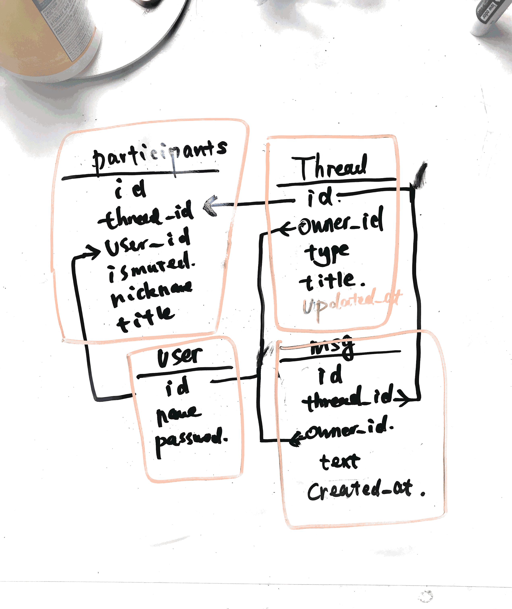

# design whats app

## Step 1: Outline use cases and constraints

### Use cases (ask interviewer)

* **User** login/register
* **User** sends message to each other
* group chat
* User online status
* chat history
* multi deveices

### Constraints
* 1Billion Monthly active users
* 750M daily active users, let's say we have 100M DAU

### Load parameters

* QPS
  * every user sends 20 messages per day
  * 100 M * 20 / 86400 ~ 20k
  * peak QPS = 20k * 3 = 60k
* storage
  * every message is 30 bytes
  * 100M * 20 * 30 ~ 30 G perday

* [handy conversion](back-of-env/#handy-conversion-guide)

---

## Step 2: Design core components


### Use case:


* 用户如何发送消息？
    * 用户A打开App后，问 Web Server 要一个 Delivery Service 的连接地址
    * A通过 socket 与Delivery server保持连接
    * 用户B发消息给A，消息先被发送到服务器
    * 服务器把消息存储之后，告诉 Delivery Server 让他通知 A
    * A 收到及时的消息提醒

### DB schema
既然是聊天软件，自然需要一个 Message Table 了
if we only have one message table which looks like


| id  | sender_id | receiver_id  | content | created_at|
| ------------- |:-------------:| -----:| ------:|---:|
| 12|123 | 234   |hello |12:30:12 |


To query the dialog between A & B, we need to scan the entire message Table, which is not efficient

```
SELECT * FROM message_table
WHERE from_user_id=A and to_user_id=B OR to_user_id=B and from_user_id=A
ORDER BY created_at DESC;
```

And if we can't scale this kind of query to group chat.

So we need a way to map many messages that to a single dialog.
Thus we create thread table, note that multiple user can participate in a thread & a user can participate multiple thread, so we have many to many mapping here. Relational data model fits right in.

And we need to query the threads that belongs to a single user by creating secondary index on the owner_id.

We also need to sort the threads by it's updated time, so another secondary index should be created.

```
SELECT * FROM thread_table
where owner_id=123
ORDER BY updated_at DESC
```



---

## Step 4: Scale the design

#### Motivation
数据量增大，数据库需要多台. Partition the database to allow more data to be stored and better performance.

#### How to scale
Sharding Key 的选取，取决于 Query 到底是什么。

Message Table 中，我们通常的需求是查询某个 Thread 下的所有 Messages。那么这个时候“某个
Thread”的信息 thread_id 我们是肯定会带上的。所以 Message Table 应该 thread_id 进行 sharding。

Thread Table 中，我们通常的查询需求是查询某个用户的所有 threads。所以这个时候”某个用户“的信
息 user_id 我们是肯定会带上的，所以 Thread Table 应该按照 user_id 进行 sharding。

#### how to speed up
Push Service 提供 Socket 连接服务，可以与Client保持TCP的长连接
* 当用户打开APP之后，就连接上Push Service 中一个属于自己的socket。
* 有人发消息的时候，Message Service 收到消息，通过Push Service把消息发出去
* 如果一个 用户长期不活跃（比如10分钟），可以断开链接，释放掉网络端口
* 断开连接之后，如何收到新消息？
* 打开APP时主动 Poll + Android GCM / IOS APNS
* Socket 链接 与 HTTP 链接的最主要区别是
* HTTP链接下，只能客户端问服务器要数据
* Socket链接下，服务器可以主动推送数据给客户端

#### How to support large group chat?

* 假如一个群有500人（1m用户也同样道理）
* 如果不做任何优化，需要给这 500 人一个个发消息
* 但实际上 500 人里只有很少的一些人在线（比如10人）
* 但Message Service仍然会尝试给他们发消息
    * Message Service (web server) 无法知道用户和Push Server的socket连接是否已经断开
    * Push Server 自己才知道
* 消息到了Push Server 才发现490个人根本没连上
• Message Service 与 Push Server 之间白浪费490次消息传递

Solution:
增加一个Channel Service（频道服务）

* 为每个聊天的Thread增加一个Channel信息
* 对于较大群，在线用户先需要订阅到对应的 Channel 上
    * 用户上线时，Web Server (message service) 找到用户所属的频道（群），并通知 Channel Service 完成订阅
    * Channel就知道哪些频道里有哪些用户还活着
    * 用户如果断线了，Push Service 会知道用户掉线了，通知 Channel Service 从所属的频道里移除
* Message Service 收到用户发的信息之后
    * 找到对应的channel
    * 把发消息的请求发送给 Channel Service
    * 原来发500条消息变成发1条消息
• Channel Service 找到当前在线的用户
• 然后发给 Push Service 把消息 Push 出去

Channel Service 用什么存储数据？内存就好了，数据重要程度不高，挂了就重启
因为还可以通过 IOS / Android 的 Push Notification / Poll 的方式补.

####  How to check / update online status?

Update online status 包含两个部分

* 服务器需要知道谁在线谁不在线
* 用户需要知道我的哪些好友在线

Push model:

1. 服务器需要知道谁在线谁不在线
    * 用户上线之后，与 Push Service 保持 socket 连接
    * 用户下线的时候，告诉服务器断开连接
    * 问题：服务器怎么知道你什么时候下线的？万一只是暂时性网络断了呢？

2. 用户需要知道我的哪些好友在线
    * 用户上线/下线之后，服务器得到通知
    * 服务器找到我的好友，告诉他们我来了 / 我走了
    * 问题1：同上，你怎么知道谁下线了
    * 问题2：一旦某一片区的网络出现具体故障
        * 恢复的时候，一群人集体上线，比如有N个人
        * 那么要通知这N个人的 N * 100 个好友，㐀成网络堵塞
    * 问题3：大部分好友不在线

pull model:

1. 服务器需要知道谁在线谁不在线
    * 用户上线之后，每隔10秒向服务器heart beat一次
    * 服务器超过1分钟没有收到信息，就认为已经下线
2. 用户需要知道我的哪些好友在线
    * 每隔10秒告诉服务器我还在，并要一下自己好友的在线状态
